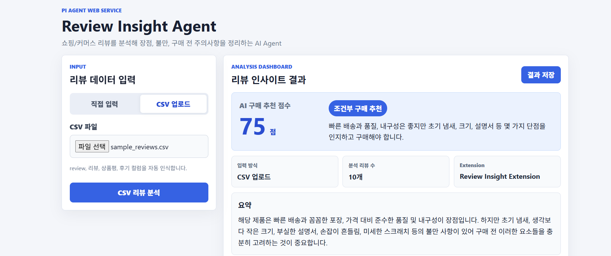
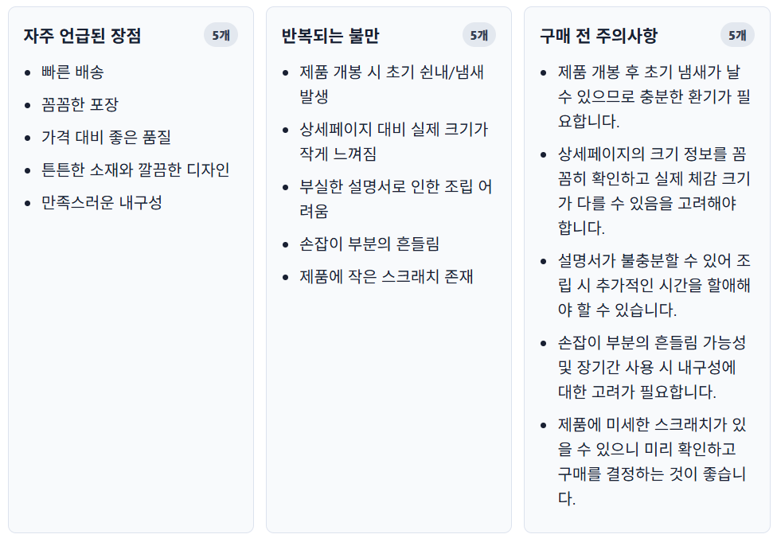
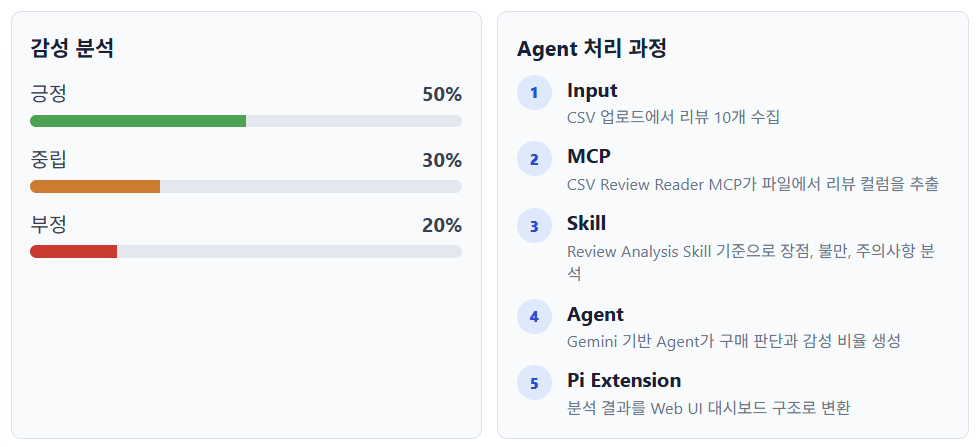
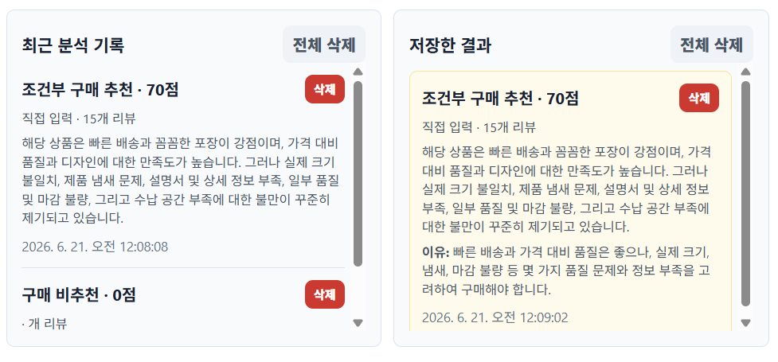

# Review Insight Agent

구매자를 위한 쇼핑/커머스 리뷰 분석 AI Agent 웹 서비스입니다.

사용자가 상품 리뷰를 직접 입력하거나 CSV 파일을 업로드하면 AI가 리뷰를 분석하여 장점, 불만, 구매 전 주의사항, 감성 분석, AI 구매 추천 점수를 제공합니다.

본 프로젝트는 Pi Agent 구조를 기반으로 Skill, MCP, Pi Extension, Web UI를 결합하여 구현되었습니다.

---

# Project Scenario

선택한 시나리오

구매자용 쇼핑/커머스 리뷰 분석 Agent

상품 리뷰 데이터를 입력받아 다음 정보를 자동으로 분석합니다.

* 리뷰 요약
* 장점(Pros)
* 불만(Complaints)
* 구매 전 주의사항(Buyer Warnings)
* 감성 분석(Sentiment Analysis)
* AI 구매 추천 점수(Recommendation Score)
* 구매 판단 결과

---

# Problem Definition

온라인 쇼핑몰에는 수백~수천 건의 리뷰가 존재합니다.

구매자가 모든 리뷰를 직접 읽고 상품의 장점과 단점을 파악하는 것은 많은 시간과 노력이 필요합니다.

본 프로젝트는 리뷰 데이터를 자동 분석하여 핵심 정보를 제공함으로써 구매자의 합리적인 구매 의사결정을 지원합니다.

---

# Target Users

* 온라인 쇼핑 이용자
* 스마트스토어 구매자
* 쿠팡 구매자
* 가격 비교 사용자
* 구매 전 상품 정보를 빠르게 파악하고 싶은 소비자

---

# Main Features

## 1. Review Input

사용자가 직접 리뷰를 입력할 수 있습니다.

예시

```txt
배송이 빨라요.
포장이 꼼꼼해요.
상품에서 냄새가 납니다.
```

---

## 2. CSV Upload

CSV 파일을 업로드하여 다수의 리뷰를 분석할 수 있습니다.

예시

```csv
review
배송이 빨라요
포장이 좋아요
냄새가 납니다
```

---

## 3. Review Analysis

리뷰 데이터를 분석하여 다음 정보를 제공합니다.

* 장점
* 불만
* 구매 전 주의사항
* 감성 분석
* AI 구매 추천 점수
* 구매 판단 결과

---

## 4. AI Recommendation

장점과 불만을 종합하여 구매 추천 점수를 제공합니다.

예시

```txt
AI 구매 추천 점수 : 78점

조건부 구매 추천

냄새 관련 불만이 일부 존재하므로 구매 전 확인이 필요합니다.
```

---

## 5. Analysis History

최근 분석 결과를 자동 저장합니다.

* 분석 일시
* 구매 추천 점수
* 구매 판단 결과
* 리뷰 요약

---

## 6. Dashboard UI

분석 결과를 카드 형태로 시각화하여 제공합니다.

* 장점 카드
* 불만 카드
* 구매 전 주의사항 카드
* AI 구매 판단 카드
* 감성 분석 그래프
* 분석 기록 카드

---

# System Architecture

```text
User
  ↓

Web UI
  ↓

Review Insight Agent
  ↓

Review Analysis Skill
  ↓

CSV Review Reader MCP
  ↓

Review Insight Extension
  ↓

Gemini API
  ↓

Analysis Result
```

---

# Technology Stack

## Frontend

* HTML
* CSS
* JavaScript

## Backend

* Node.js
* Express

## File Processing

* Multer
* CSV Parser

## AI Model

* Google Gemini API

## Agent Framework

* Pi Agent
* Skill
* MCP
* Pi Extension

---

# Pi Utilization

본 프로젝트는 Pi Agent 구조를 기반으로 설계되었습니다.

Pi Agent는 Review Analysis Skill을 참조하여 리뷰 분석을 수행하며, MCP를 통해 CSV 리뷰 데이터를 수집하고, Extension을 통해 분석 결과를 Web UI에 적합한 형태로 변환합니다.

Pi 실행 예시

```bash
pi --skill skills/review-analysis-skill -p "배송은 빠르지만 상품에서 쉰내가 나고 크기가 작다는 리뷰를 구매자 관점에서 분석해줘."
```

---

# Skill Utilization

## Review Analysis Skill

상품 리뷰를 분석하여 다음 정보를 추출합니다.

* 장점
* 불만
* 구매 전 주의사항
* 감성 분석
* 구매 추천 점수

위치

```text
skills/review-analysis-skill/SKILL.md
```

---

# MCP Utilization

## CSV Review Reader MCP

CSV 파일에서 리뷰 데이터를 추출하여 Agent에 전달합니다.

위치

```text
mcp/csv-review-reader
```

---

# Pi Extension Utilization

## Review Insight Extension

분석 결과를 Web UI에 적합한 형태로 변환합니다.

위치

```text
pi-extension/review-insight-extension
```

---

# Installation

```bash
npm install
```

---

# Run

```bash
npm start
```

브라우저 접속

```text
http://localhost:3000
```

---

# Project Structure

```text
review-insight-agent

├─ backend
│   ├─ analyzer.js
│   └─ server.js
│
├─ frontend
│   ├─ app.js
│   ├─ index.html
│   └─ style.css
│
├─ skills
│   └─ review-analysis-skill
│       └─ SKILL.md
│
├─ mcp
│   └─ csv-review-reader
│       └─ index.js
│
├─ pi-extension
│   └─ review-insight-extension
│       └─ index.js
│
├─ .pi
│   └─ agents
│       └─ review-analyst.md
│
├─ AGENTS.md
└─ README.md
```

---

# Future Improvements

* 상품 URL 입력 기능
* 유사 상품 추천
* 상품 비교 기능
* 관심 상품 저장 기능
* 리뷰 키워드 자동 군집화
* 카테고리별 분석
* 리뷰 트렌드 분석

---

# Screenshots

### Main UI



### Insight Cards



### Sentiment Analysis and Agent Flow



### History and Saved Results




